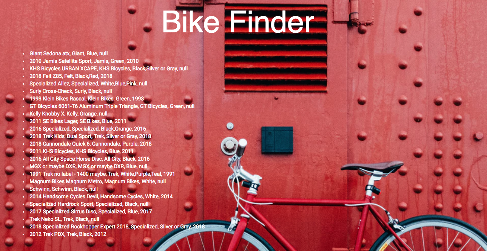

# _Bike Finder_

##### Find Your Bike! 03/22/2018

### By Hannah Lee and Maggie Summers

## Description

An application that demonstrates making an API call and dealing with asynchrony in JavaScript.

## Behavior

| Spec | Input | Output |
| :---------------| :---------------| :---------------|
| Will return a list of bikes based on manufacturer, type, color and year based on location. | Portland, OR | 2010 Jamis Satellite Sport, Jamis, Green, 2010 |

<kbd></kbd>

## Technologies Used
------------

```
Application: JavaScript, jQuery, Bootstrap, HTML
Testing: Jasmine, Karma
Environment: npm, webpack, babel, esLint
API: Bike Index
```

Installation
------------

```
$ git clone https://github.com/RunHannah/bike-finder
```

_Requires node.js; instructions to install:_ https://www.learnhowtoprogram.com/javascript/getting-started-with-javascript-2f9a73dc-b7f5-4a22-9101-e69d49f552ac/installing-node-js

Install required npm packages and dependencies:

```
$ npm install
$ npm run build
```

Register at Bike Index to receive API key at URL below. Place in .env file.

```
https://bikeindex.org/documentation/api_v3
```

Start the webserver:
```
$ npm run start
```

## Known Bugs

 * _No known bugs at this time._

## Support and contact details

 _To suggest changes, submit a pull request in the GitHub repository._

### License

 _Licensed under MIT license_
-------

GNU GPL v2. Copyright 2018 **Hannah Lee and Maggie Summers**
